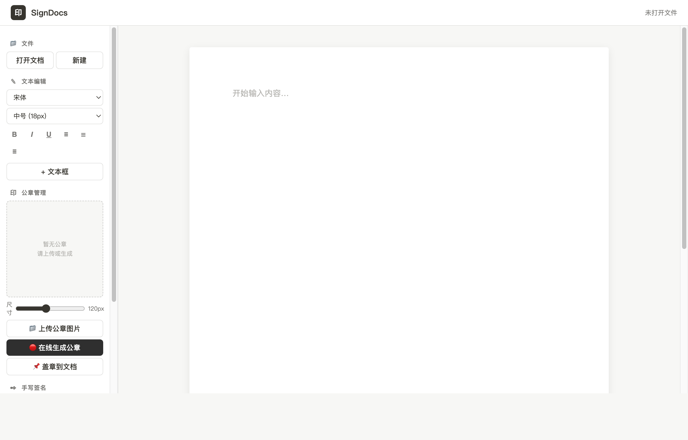

# SignDocs — Document Signing & Stamping Editor

[](https://github.com/Createitv/sign-docs/releases/latest)
[](LICENSE)

[中文文档](README.zh.md)

A lightweight, privacy-first desktop app for signing and stamping documents. Open PDF or Word files, generate official-looking company seals, draw handwritten signatures, and export everything as a single PDF — all offline, no data ever leaves your machine.

Built with [Tauri](https://tauri.app/) + Vanilla JS. Runs on macOS, Windows and Linux.



## Features

- **Open Documents** — PDF and Word (DOCX/DOC) with faithful rendering via `pdf.js` and `docx-preview`
- **Electronic Seal** — Upload your own seal image or generate a circular Chinese company seal with custom text, star, and serial number
- **Handwritten Signature** — Draw smooth signatures with pressure-sensitive Bezier curves in a dedicated signing pad; pick pen color freely
- **Text Boxes** — Add draggable, editable text overlays anywhere on the document
- **Export to PDF** — One-click export with all seals, signatures and annotations baked in
- **Offline & Private** — Zero network calls, zero telemetry; your documents stay on your computer

## Quick Start

```bash
# Development (browser)
npm install
npm run dev          # → http://localhost:1420

# Desktop app (Tauri)
npm run tauri dev
```

## Download

Pre-built binaries are available on the [Releases page](https://github.com/Createitv/sign-docs/releases/latest).

| Platform | File |
|----------|------|
| macOS Apple Silicon | `SignDocs_*_aarch64.dmg` |
| macOS Intel | `SignDocs_*_x64.dmg` |
| Windows | `SignDocs_*_x64-setup.exe` |
| Linux | `SignDocs_*_amd64.AppImage` |

## Tech Stack

| Layer | Technology |
|-------|-----------|
| Shell | [Tauri 2](https://tauri.app/) (Rust) |
| Frontend | Vanilla JS + Vite |
| PDF Render | [pdf.js](https://mozilla.github.io/pdf.js/) |
| DOCX Render | [docx-preview](https://github.com/VolodymyrBayworker/docx-preview) |
| PDF Export | [jsPDF](https://github.com/parallax/jsPDF) + [html2canvas](https://html2canvas.hertzen.com/) |

## License

[MIT](LICENSE) — free for personal and commercial use.
